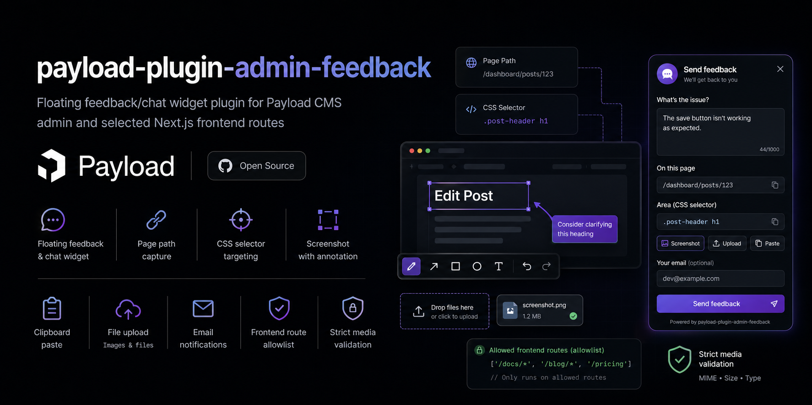

# payload-plugin-admin-feedback

Floating feedback/chat widget plugin for Payload CMS admin and selected Next.js frontend routes.

## Features

- Adds `admin-feedback` collection to Payload
- Floating client widget with:
  - message input
  - current page path capture
  - optional CSS selector capture
  - current-tab-first screenshot capture, full-screen annotation, clipboard paste, and file upload
  - native HTML5 tools for pen, rectangle, arrow, text, undo, redo, clear, and revert
- Email notification on feedback creation through configured Payload email adapter
- Frontend allowlist route matching helper
- Strict media collection validation with fail-fast startup errors

## Install

```bash
pnpm add payload-plugin-admin-feedback
```

## Requirements

- `payload` `^3.84.1` (native advanced plugin API with `definePlugin`)
- `react` ^19

## Version Compatibility

| Plugin Version | Payload Version |
| -------------- | --------------- |
| 1.x.x          | ^3.84.1         |

## Setup

### 1. Register the plugin in your Payload config

```ts
import { buildConfig } from 'payload'
import { adminFeedbackPlugin } from 'payload-plugin-admin-feedback'

export default buildConfig({
  // ...
  plugins: [
    adminFeedbackPlugin({
      emailTo: 'it@example.com',
      fromLabel: 'Store Admin Feedback',
      fromName: 'Payload Admin',
      fromAddress: 'noreply@example.com',
      allowScreenshotUpload: true,
      mediaCollectionSlug: 'files',
      strictMediaCollection: true,
      screenshot: {
        enabled: true,
        maxFileSizeBytes: 5 * 1024 * 1024,
        allowedMimeTypes: ['image/png', 'image/jpeg', 'image/webp'],
        capturePolicy: 'current-tab-first',
      },
      maxMessageLength: 3000,
      frontend: {
        enabled: true,
        include: ['/marketplace*', '/profile*'],
      },
      tenant: {
        enabled: true,
        collectionSlug: 'tenants',
        fieldName: 'tenant',
        formDataSlugKey: 'tenant',
        pathMarkers: ['pisarna', 'narocilnica'],
        resolveTenantId: async ({ req, tenantSlug }) => {
          // Optional host fallback (admin cookie, subdomain, …)
          return null
        },
      },
    }),
  ],
})
```

This registers the `admin-feedback` collection with custom endpoints (`/submit`, `/upload`, `/upload/:id`) — no additional API routes are needed.

### Multi-tenant media uploads

When `tenant.enabled` is true, screenshot uploads set the configured relationship field on `mediaCollectionSlug`. Resolution order:

1. Tenant slug in upload `FormData` (set automatically when `tenantPathMarkers` is passed to `FrontendFeedbackWidget`)
2. Slug parsed from the request URL via `tenant.pathMarkers`
3. `tenant.resolveTenantId` callback for host-specific logic

If your project stores uploads in a collection named `files` instead of `media`, set `mediaCollectionSlug: 'files'` exactly as shown above. The plugin validates that the target collection exists and is upload-enabled during startup.

### 2. Add the admin panel widget

In your Payload admin layout (`src/app/(payload)/layout.tsx`):

```tsx
import { AdminFeedbackWidget } from 'payload-plugin-admin-feedback/client'

export default function Layout({ children }: { children: React.ReactNode }) {
  return (
    <RootLayout config={config} importMap={importMap} serverFunction={serverFunction}>
      {children}
      <AdminFeedbackWidget />
    </RootLayout>
  )
}
```

The admin widget automatically sends authenticated requests (HTTP-only cookies via `credentials: 'include'`).

### 3. Add the frontend widget

In your Next.js frontend locale layout (`src/app/(frontend)/[locale]/layout.tsx`):

```tsx
import { FrontendFeedbackWidget } from 'payload-plugin-admin-feedback/client'

export default async function LocaleLayout({ children, params }) {
  return (
    <html>
      <body>
        {/* ... */}
        <FrontendFeedbackWidget
          include={['/marketplace*', '/profile*', '/checkout*']}
          locales={['en', 'ru', 'sl']}
        />
        {children}
        {/* ... */}
      </body>
    </html>
  )
}
```

**`FrontendFeedbackWidget` props:**

| Prop | Type | Default | Description |
|------|------|---------|-------------|
| `include` | `string[]` | required | Glob-style route patterns to show the widget on. Supports `*` wildcard suffixes (e.g. `'/profil*'` matches `/profile`, `/profile/orders/123`). |
| `locales` | `string[]` | `[]` | Supported locale prefixes. The widget strips the locale segment before matching against `include` patterns. If all your routes are non-prefixed, leave empty. |
| `title` | `string` | `'Feedback'` | Widget title. |
| `submitLabel` | `string` | `'Send'` | Submit button label. |
| `uploadLabel` | `string` | `'Upload image'` | Upload button label. |
| `tenantPathMarkers` | `string[]` | `[]` | Path markers — tenant slug is the segment before each marker; sent on upload. |
| `tenantFormDataKey` | `string` | `'tenant'` | FormData key for tenant slug. |

**How locale normalization works:** When `locales` is `['en', 'ru', 'sl']`, the widget strips the first path segment if it matches a locale. For example, `/en/marketplace` becomes `/marketplace` before checking the `include` patterns. This means you write patterns once and they work across all locales.

## Plugin Options

- `enabled?: boolean` default `true`
- `emailTo: string | string[]` required recipient address or addresses
- `fromLabel?: string` label used by the widget and email output
- `fromName?: string` optional sender name for feedback emails
- `fromAddress?: string` optional sender address for feedback emails
- `email?: Config['email']` optional Payload email config injected only when `config.email` is not already set
- `allowScreenshotUpload?: boolean` default `true`; enables image upload support in the widget, including annotated screenshot uploads
- `maxMessageLength?: number` default `3000`
- `mediaCollectionSlug?: string` default `'media'`; slug of the upload-enabled collection used for image uploads
- `strictMediaCollection?: boolean` default `true`; when `true`, startup fails if `mediaCollectionSlug` is missing or not upload-enabled
- `screenshot?: { enabled?: boolean; maxFileSizeBytes?: number; allowedMimeTypes?: string[]; capturePolicy?: 'current-tab-first' | 'strict-current-tab' | 'any-surface' }`
- `frontend?: { enabled?: boolean; include?: string[] }`
- `frontendRouteMatcher?: (pathname: string) => boolean` optional custom route matcher for frontend display logic
- `tenant?: TenantConfig` optional multi-tenant upload scoping (`enabled`, `collectionSlug`, `fieldName`, `formDataSlugKey`, `pathMarkers`, `resolveTenantId`)

## Screenshot Capture Behavior

- `allowScreenshotUpload: false` disables image uploads from the widget entirely, including saving annotated screenshots.
- `screenshot.enabled: false` disables browser screenshot capture while still allowing regular file uploads if `allowScreenshotUpload` remains `true`.
- `current-tab-first` is the default. The widget prefers the active browser tab and still accepts window or screen capture if the browser returns a broader surface.
- `strict-current-tab` requires the captured surface to resolve as a browser tab and fails otherwise.
- `any-surface` allows the browser to offer any supported surface without tab-first constraints.
- Captured, pasted, and uploaded images all open in the same full-screen HTML5 annotation editor and are exported as a flattened PNG before upload.

## Storage Adapter Compatibility

The plugin uploads images through the resolved Payload upload collection, not directly to a specific storage adapter.

- If your upload collection is configured with `@payloadcms/storage-*`, uploads are automatically stored there.
- If `strictMediaCollection` is `true` (default), plugin initialization fails when the configured `mediaCollectionSlug` is missing or not upload-enabled.
- If `strictMediaCollection` is `false` and the configured slug is missing, the plugin falls back to `'media'` only when a `'media'` collection exists and is upload-enabled.
- A collection that exists but is not upload-enabled still fails validation.

## Custom Frontend Matching

Use `frontend.include` for simple glob-style path matching. Use `frontendRouteMatcher` when widget visibility depends on custom logic that cannot be expressed as a simple allowlist.

```ts
adminFeedbackPlugin({
  emailTo: 'it@example.com',
  frontend: {
    enabled: true,
  },
  frontendRouteMatcher: (pathname) => pathname.startsWith('/app') && !pathname.startsWith('/app/embed'),
})
```

## Migration Notes

- The plugin uses native Payload advanced plugin metadata (`slug`, `order`, `options`) via `definePlugin`.
- Existing usage with `adminFeedbackPlugin({ ...options })` remains unchanged.

## License

MIT
